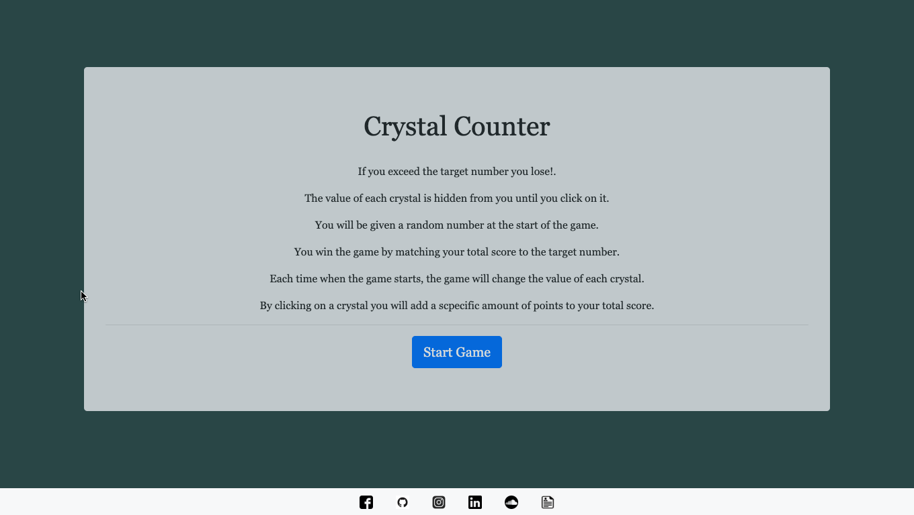
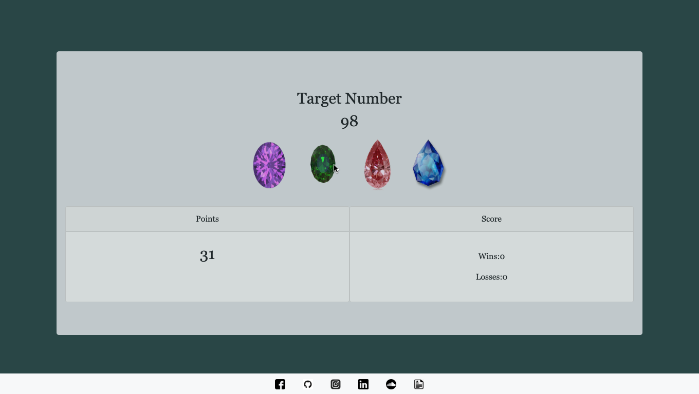

# Crytal Counter

A basic game of memory. There are four crystals below. By clicking on a crystal you will add a scpecific amount of points to your total score. You win the game by matching your total score to random number, you lose the game if your total score goes above the random number. The value of each crystal is hidden from you until you click on it. Each time when the game starts, the game will change the value of each crystal.
 

## Deployment

This app was deployed using GitHub. 
https://abusch419.github.io/unit-4-game/

## Built With

* [Bootstrap](https://getbootstrap.com/docs/4.3/getting-started/introduction/)
* [jQuery](https://api.jquery.com/)

## Authors

* **Alex Eversbusch** 

## Version

V1.0

## Screenshots
## Start Page

## Game Page

